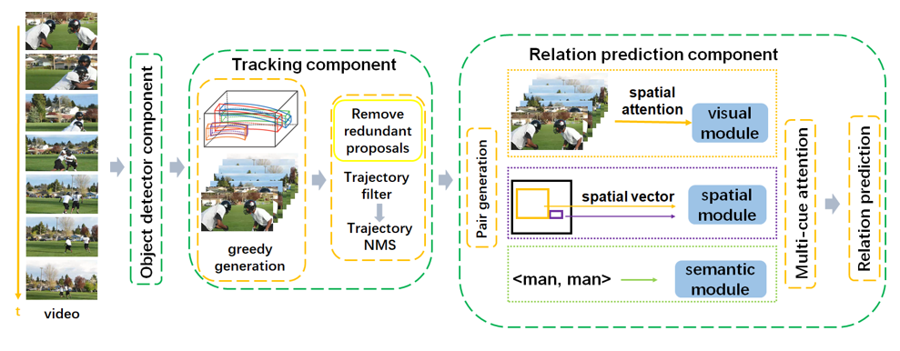

In this paper, we present our solutions to the grand challenge task "Relation Understanding in Videos" in ACM Multimedia 2019. The challenge task aims to detect instances of target visual relations in a video, where a visual relation instance is represented by a relation triplet <subject, predicate, object> with the trajectories of the subject and object. It seems that it is similar to the image relation detection task with the input changed from images to videos. However, video relation detection requires a much more complex pipeline which not only needs to detect objects in each frame, but also track them in the temporal direction. In this challenge, we follow the basic pipeline structure which consists of 3 main separate components: an object detector, an object tracker and a relation predictor. Based on our analysis, there exist data unbalance and label missing problems in the VidOR dataset. We exploit two simple but effective methods to alleviate these problems. We also use trajectory Non-Maximum Suppression and a sliding window method to address the redundancy of trajectory proposals. Experimental results on the challenge task demonstrate that by applying these proposed approaches over the state-of-the-art relation prediction model, the video relation detection performance can be improved with the precision@1 and precision@5 reaching 0.3305 and 0.3507 respectively.

<figure style="text-align: center;">

<figcaption style="text-align: center; font-size: 18px">Figure 1: Overall framework of our pipeline.</figcaption>
</figure>

