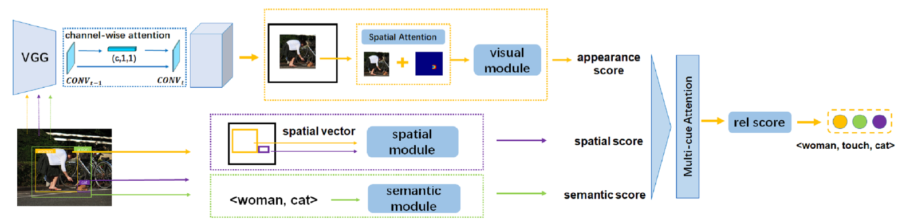

Visual relations, which describe various types of interactions between two objects in the image, can provide critical information for comprehensive semantic understanding of the image. Multiple cues related to the objects can contribute to visual relation detection, which mainly include appearances, spacial locations and semantic meanings. It is of great importance to represent different cues and combine them effectively for visual relation detection. However, in previous works, the appearance representation is simply realized by global visual representation based on the bounding boxes of objects, which may not capture salient regions of the interaction between two objects, and the different cue representations are equally concatenated without considering their different contributions for different relations. In this work, we propose a multi-level attention visual relation detection model (MLA-VRD), which generates salient appearance representation via a multi-stage appearance attention strategy and adaptively combine different cues with different importance weighting via a multi-cue attention strategy. Extensive experiment results on two widely used visual relation detection datasets, VRD and Visual Genome, demonstrate the effectiveness of our proposed model which significantly outperforms the previous state-of-the-arts. Our proposed model also achieves superior performance under the zero-shot learning condition, which is an important ordeal for testing the generalization ability of visual relation detection models.

<figure style="text-align: center;">

<figcaption style="text-align: center; font-size: 18px">Figure 1: Overall framework of our MLA-VRD model.</figcaption>
</figure>