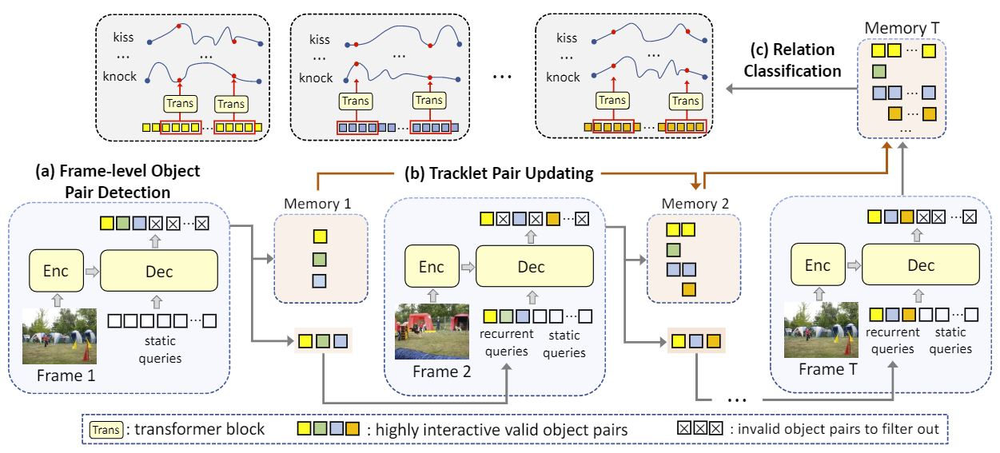
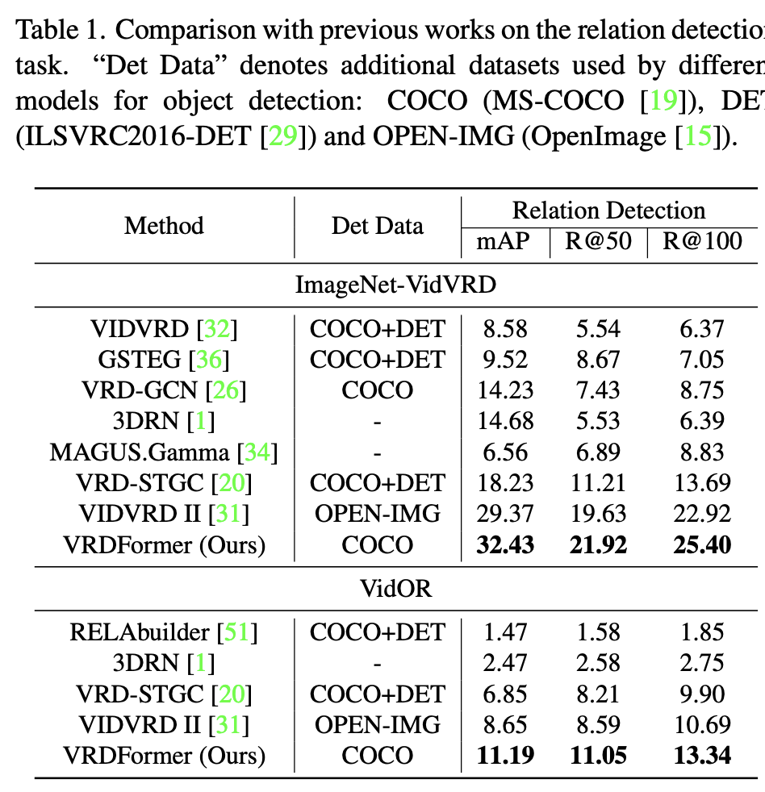
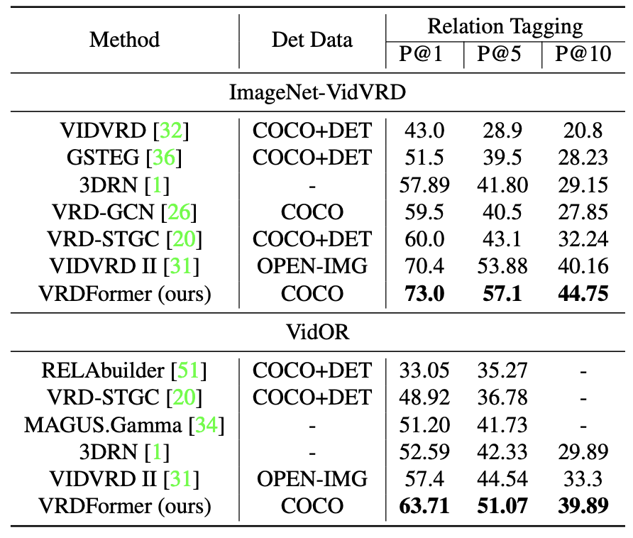

Visual relation understanding plays an essential role for holistic video understanding. Most previous works adopt a multi-stage framework for video visual relation detection (VidVRD), which cannot capture long-term spatiotemporal contexts in different stages and also suffers from inefficiency. In this paper, we propose a transformerbased framework called VRDFormer to unify these decoupling stages. Our model exploits a query-based approach to autoregressively generate relation instances. We specifically design static queries and recurrent queries to enable efficient object pair tracking with spatio-temporal contexts. The model is jointly trained with object pair detection and relation classification. Extensive experiments on two benchmark datasets, ImageNet-VidVRD and VidOR, demonstrate the effectiveness of the proposed VRDFormer, which achieves the state-of-the-art performance on both relation detection and relation tagging tasks.

<figure>

<figcaption style="text-align: left; font-size: 18px">Figure 1: Overall framework of the query-based relation instance generation module in our VRDFormer. It consists of: (a) framelevel object pair detection (blue module), which detects object pairs based on static or recurrent queries for each frame; (b) tracklet pair updating (orange module), which autoregressively updates a tracklet pair memory frame by frame. (c) relation classification (grey module), which predicts relations per frame for each detected tracklet pair with temporal aggregation to model the long-term dependencies</figcaption>
</figure>

<figure style="text-align: center;">
<figcaption style="text-align: center; font-size: 18px">Table 1: Comparison with previous works on the relation detection task.</figcaption>

</figure>

<figure style="text-align: center;">
<figcaption style="text-align: center; font-size: 18px">Table 2: Comparison results with previous state-of-the-art works on the relation tagging task.</figcaption>

</figure>
