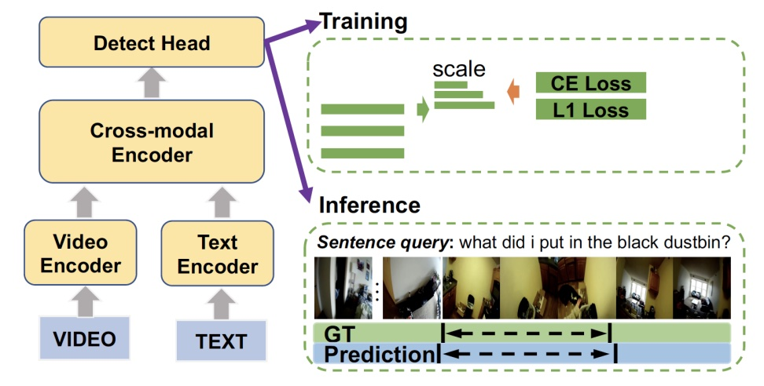

The Natural Language Localization (NLL) task aims to localize a sentence in a video with starting and ending timestamps. It requires a comprehensive understanding of both language and videos. We have seen a lot of work conducted for third-person view videos, while the task on ego-centric videos is still under-explored, which is critical for the understanding of increasing ego-centric videos and further facilitating embodied AI tasks. Directly adapting existing methods of NLL to ego-centric video datasets is challenging due to two reasons. Firstly, there is a temporal duration gap between different datasets. Secondly, queries in ego-centric videos usually require a better understanding of more complex and long-term temporal orders. For the above reason, we propose an anchor-based detection model for NLL in ego-centric videos.

<figure style="text-align: center;">

<figcaption style="text-align: center; font-size: 18px">Figure 1: Overall framework of our pipeline.</figcaption>
</figure>