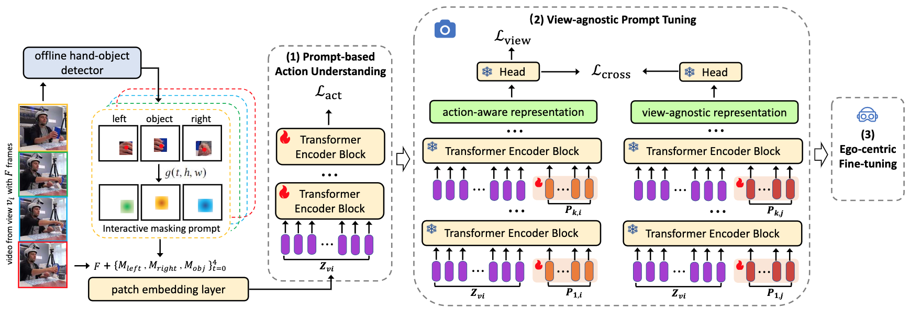

We humans are good at translating third-person observations of hand-object interactions (HOI) into an egocentric view. However, current methods struggle to replicate this ability of view adaptation from third-person to first-person. Although some approaches attempt to learn view-agnostic representation from large-scale video datasets, they ignore the relationships among multiple third-person views. To this end, we propose a Prompt-Oriented View-agnostic learning (POV) framework in this paper, which enables this view adaptation with few egocentric videos. Specifically, We introduce interactive masking prompts at the frame level to capture fine-grained action information, and view-aware prompts at the token level to learn view-agnostic representation. To verify our method, we establish two benchmarks for transferring from multiple third-person views to the egocentric view. Our extensive experiments on these benchmarks demonstrate the efficiency and effectiveness of our POV framework and prompt tuning techniques in terms of view adaptation and view generalization.

<figure style="text-align: center;">

<figcaption style="text-align: center; font-size: 18px">Figure 1: Overall framework of our proposed POV model.</figcaption>
</figure>