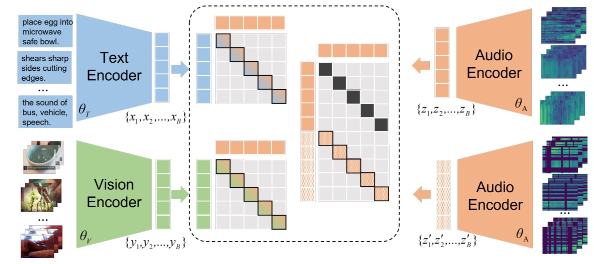

Multimodal processing has attracted much attention lately especially with the success of pre-training. However, the exploration has mainly focused on vision-language pre-training, as introducing more modalities can greatly complicate model design and optimization. In this paper, we extend the stateof-the-art Vision-Language model CLIP to accommodate the audio modality for Vision-Language-Audio multimodal processing. Specifically, we apply inter-modal and intra-modal contrastive learning to explore the correlation between audio and other modalities in addition to the inner characteristics of the audio modality. Moreover, we further design an audio type token to dynamically learn different audio information type for different scenarios, as both verbal and nonverbal heterogeneous information is conveyed in general audios. Our proposed CLIP4VLA model is validated in different downstream tasks including video retrieval and video captioning, and achieves the state-of-the-art performance on the benchmark datasets of MSR-VTT, VATEX, and Audiocaps.

<figure style="text-align: center;">

<figcaption style="text-align: center; font-size: 18px">Figure 1</figcaption>
</figure>