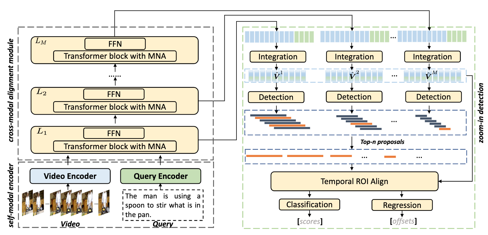

Temporal video grounding (TVG) aims to retrieve the time interval of a language query from an untrimmed video. A significant challenge in TVG is the low "Semantic Noise Ratio (SNR)", which results in worse performance with lower SNR. Prior works have addressed this challenge using sophisticated techniques. In this paper, we propose a no-frills TVG model that consists of two core modules, namely multi-scale neighboring attention and zoom-in boundary detection. The multi-scale neighboring attention restricts each video token to only aggregate visual contexts from its neighbor, enabling the extraction of the most distinguishing information with multi-scale feature hierarchies from high-ratio noises. The zoom-in boundary detection then focuses on local-wise discrimination of the selected top candidates for fine-grained grounding adjustment. With an end-to-end training strategy, our model achieves competitive performance on different TVG benchmarks, while also having the advantage of faster inference speed and lighter model parameters, thanks to its lightweight architecture.

<figure>

<figcaption style="font-size: 18px">Figure 1: Our framework comprises three key components: (1) self-modal encoder; (2) cross-modal alignment module enhanced by multiscale neighboring attention (MNA); (3) zoom-in boundary detection (ZBD) that utilizes multi-scale hierarchy.</figcaption>
</figure>