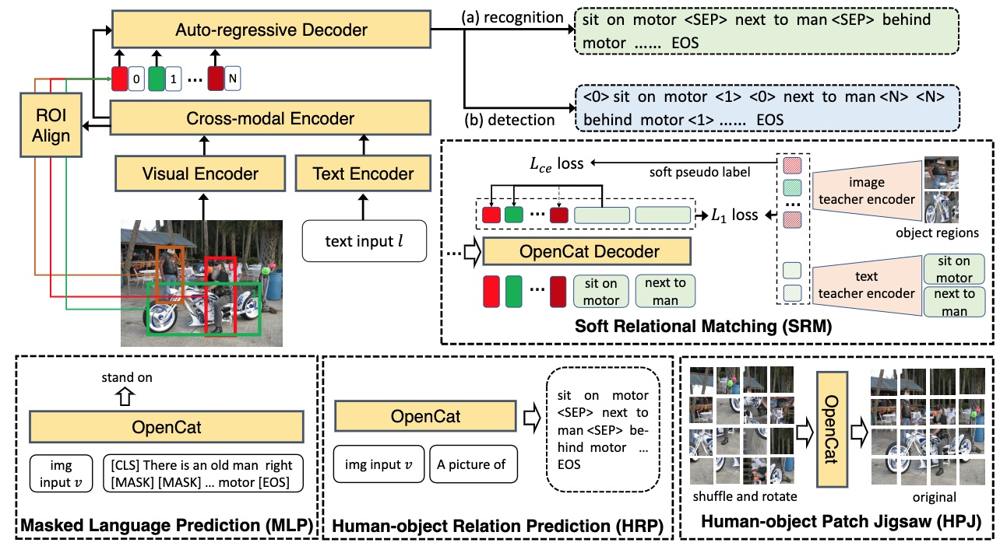

Human-object interaction (HOI) has long been plagued by the conflict between limited supervised data and a vast number of possible interaction combinations in real life. Current methods trained from closed-set data predict HOIs as fixed-dimension logits, which restricts their scalability to open-set categories. To address this issue, we introduce OpenCat, a language modeling framework that reformulates HOI prediction as sequence generation. By converting HOI triplets into a token sequence through a serialization scheme, our model is able to exploit the open-set vocabulary of the language modeling framework to predict novel interaction classes with a high degree of freedom. In addition, inspired by the great success of vision-language pre-training, we collect a large amount of weakly-supervised data related to HOI from image-caption pairs, and devise several auxiliary proxy tasks, including soft relational matching and human-object relation prediction, to pre-train our model. Extensive experiments show that our OpenCat significantly boosts HOI performance, particularly on a broad range of rare and unseen categories.

<figure>

<figcaption style="font-size: 18px">Figure 1: Our proposed open-category HOI model, OpenCat, auto-regressively generates HOI triplets as a token sequence. To pretrain
the model, we utilize large-scale weak text supervision and employ four auxiliary proxy tasks: (1) masked language prediction (MLP); (2)
human-object relation prediction (HRP); (3) human-object patch jigsaw (HPJ) and (4) soft relational matching (SRM).</figcaption>
</figure>