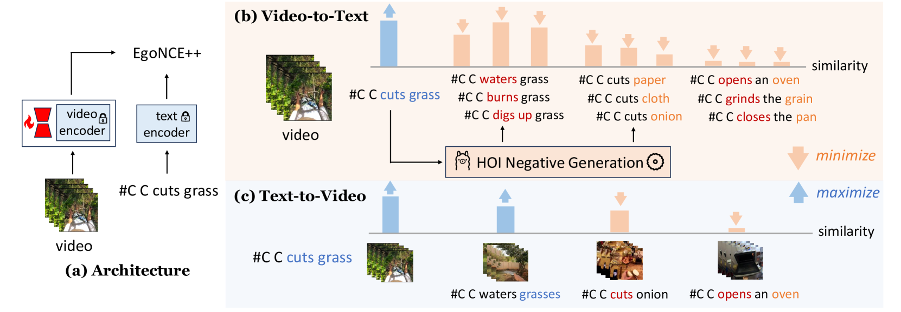

In this paper, we propose \textbf{UniCode}, a novel approach within the domain of multimodal large language models (MLLMs) that learns a unified codebook to efficiently tokenize visual, text, and potentially other types of signals. 
This innovation addresses a critical limitation in existing MLLMs: their reliance on a text-only codebook, which restricts MLLM's ability to generate images and texts in a multimodal context. 
Towards this end, we propose a language-driven iterative training paradigm, coupled with an in-context pre-training task we term ``image decompression'', enabling our model to interpret compressed visual data and generate high-quality images.
The unified codebook empowers our model to extend visual instruction tuning to non-linguistic generation tasks. Moreover, UniCode is adaptable to diverse stacked quantization approaches in order to compress visual signals into a more compact token representation. 
Despite using significantly fewer parameters and less data during training, Unicode demonstrates promising capabilities in visual reconstruction and generation. It also achieves performances comparable to leading MLLMs across a spectrum of VQA benchmarks.

<figure>

<figcaption style="font-size: 18px">Figure 1: Illustration of our pretraining framework. (a) EgoVLMs are trained with EgoNCE++, where the visual encoder is trained using LoRA [14] to enhance video representation, while the text encoder remains frozen. Specifically, EgoNCE++ consists of (b) V2T: generating HOI-related negative captions for fine-grained supervision, and (c) T2V: leveraging the strong ability of EgoVLMs to recognize nouns by aggregating video features with similar nouns.</figcaption>
</figure>
