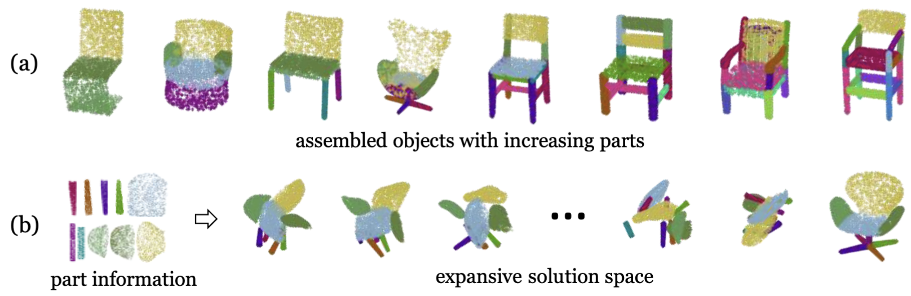

We introduce SPAFormer, an innovative model designed to overcome the combinatorial explosion challenge in the 3D Part Assembly (3D-PA) task. 
This task requires accurate prediction of each part’s pose and shape in sequential steps, and as the number of parts increases, the possible assembly combinations increase exponentially, leading to
a combinatorial explosion that severely hinders the efficacy of 3D-PA.
SPAFormer addresses this problem by leveraging weak constraints from assembly sequences, effectively reducing the solution space’s complexity. 
Since assembly part sequences convey construction rules similar to sentences being structured through words, our model explores both parallel and autoregressive generation.
It further enhances assembly through knowledge enhancement strategies that utilize the attributes of parts and their sequence information, enabling it to capture the inherent assembly pattern and relationships among sequentially ordered parts. 
We also construct a more challenging benchmark named PartNet-Assembly covering 21 varied categories to more comprehensively validate the effectiveness of SPAFormer.
Extensive experiments demonstrate the superior generalization capabilities of SPAFormer, particularly with multi-tasking and in scenarios requiring long-horizon assembly. 
Codes and model weights will be released at https://github.com/xuboshen/SPAFormer

<figure>

<figcaption style="font-size: 18px">Figure 1: : Illustration of the combinatorial explosion challenge inherent in the assembly process. Specifically: (a) the number of constituent parts increases when the target object for assembly becomes more complex. (b) For an object composed of n parts, where we assume each part can occupy one of m discrete positions, the potential combinations of these parts grow at an extraordinary rate, exceeding O(m^n) in complexity.</figcaption>
</figure>
