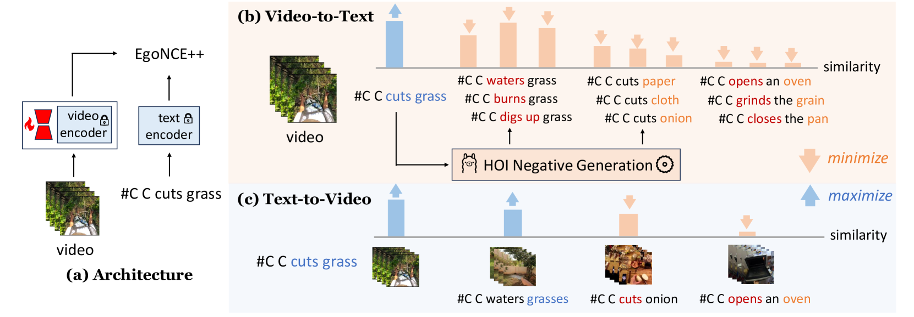

Egocentric video-language pretraining is a crucial paradigm to advance the learning of egocentric hand-object interactions (EgoHOI). Despite the great success on existing testbeds, these benchmarks focus more on closed-set visual concepts or limited scenarios. Due to the occurrence of diverse EgoHOIs in the real world, we propose an open-vocabulary benchmark named EgoHOIBench to reveal the diminished performance of current egocentric video-language models (EgoVLM) on fined-grained concepts, indicating that these models still lack a full spectrum of egocentric understanding. We attribute this performance gap to insufficient fine-grained supervision and strong bias towards understanding objects rather than temporal dynamics in current methods. To tackle these issues, we introduce a novel asymmetric contrastive objective for EgoHOI named EgoNCE++. For video-to-text loss, we enhance text supervision through the generation of negative captions by leveraging the in-context learning of large language models to perform HOI-related word substitution. For text-to-video loss, we propose an object-centric positive video sampling strategy that aggregates video representations by the same nouns. Our extensive experiments demonstrate that EgoNCE++ significantly boosts open-vocabulary HOI recognition, multi-instance retrieval, and action recognition tasks across various egocentric models, with improvements of up to +26.55%. Our code is available at https://github.com/xuboshen/EgoNCEpp.

<figure>

<figcaption style="font-size: 18px">Figure 1: Illustration of our pretraining framework. (a) EgoVLMs are trained with EgoNCE++, where the visual encoder is trained using LoRA [14] to enhance video representation, while the text encoder remains frozen. Specifically, EgoNCE++ consists of (b) V2T: generating HOI-related negative captions for fine-grained supervision, and (c) T2V: leveraging the strong ability of EgoVLMs to recognize nouns by aggregating video features with similar nouns.</figcaption>
</figure>
