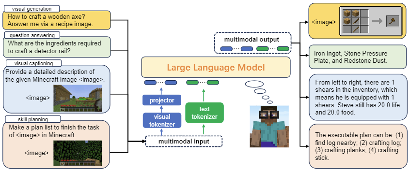

Recent studies have presented compelling evidence that large language models (LLMs) can equip embodied agents with the self-driven capability to interact with the world, which marks an initial step toward versatile robotics. However, these efforts tend to overlook the visual richness of open worlds, rendering the entire interactive process akin to "a blindfolded text-based game." Consequently, LLM-based agents frequently encounter challenges in intuitively comprehending their surroundings and producing responses that are easy to understand. In this paper, we propose Steve-Eye, an end-to-end trained large multimodal model designed to address this limitation. Steve-Eye integrates the LLM with a visual encoder which enables it to process visual-text inputs and generate multimodal feedback. In addition, we use a semi-automatic strategy to collect an extensive dataset comprising 850K open-world instruction pairs, empowering our model to encompass three essential functions for an agent: multimodal perception, foundational knowledge base, and skill prediction and planning. Lastly, we develop three open-world evaluation benchmarks, then carry out extensive experiments from a wide range of perspectives to validate our model's capability to strategically act and plan. Codes and datasets will be released.

<figure>

<figcaption style="font-size: 18px">Figure 1: Illustration of Steve-Eye: a large multimodal model designed to seamlessly process both visual and language inputs. Steve-Eye excels in acquiring fundamental knowledge of the world it lives in, understanding the nuances of its surroundings, and generating executable plans to complete a wide array of open-ended tasks. Furthermore, Steve-Eye responds to user instructions through either visual or text-based cues, enhancing the convenience and flexibility of human-AI interaction.</figcaption>
</figure>
